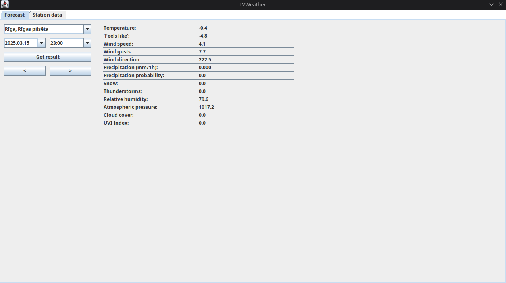

# lvweather
The purpose of the program is to scrape, store and display weather forecast and weather monitoring station data from the Latvian governmental agencies *Latvian Environment, Geology and Meteorology Centre* provided API's. Storage is a MySQL/MariaDB database and the GUI is made with Swing.

As a disclaimer, it is possible that the data could be accessed in a more *proper and neat* way than the current solution for scraping. More specifically, the method for acquiring location ID's that map 1:1 to some city, town or village in Latvia requires 36 GET requests. A box of co-ordinates surrounding Latvia is split up in a 6x6 grid and each GET request tries to acquire data for a single one of these smaller boxes. When I was originally made this project, I could not find a better way.

This project was originally made as the coursework for a "Introduction to programming II" course at university.

## Installation
### Pre-requisites
Java Runtime version 17 should work.

Regardless of your OS. You must have a `mysql` (or `mariadb`) database set-up locally with port `3306`.
On Linux I recommend using `mariadb` which is fully compatible with `mysql`.

### Linux
Run `run.sh` in the root of this repository. It will run `javac` to compile the program and `java` to run it.

`run.sh` looks something like this:
```bash
javac -d bin/ -cp lib/json.jar:lib/jsoup-1.13.1.jar:lib/mysql-connector-java-5.1.48.jar:lib/swingx-all-1.6.4.jar src/LVWeather/*.java &&
java -cp ./bin:lib/json.jar:lib/jsoup-1.13.1.jar:lib/mysql-connector-java-5.1.48.jar:lib/swingx-all-1.6.4.jar LVWeather.Main
```

### Windows
Should work on windows if you open and run the project in the [Java Eclipse IDE](https://eclipseide.org/) as that is where the project was originally developed.

Better instructions may follow later...

## Dependencies and Libraries
##### DB
As of 2025.03.15, `mariadb 11.7.2-1` has been tested to work with this project, but any future version of MariaDB or MySQL should work just as well.

##### Java libraries
Libraries are already included in the `./lib` directory. Many are likely out of date but should still work. Here is a complete list of .jar libraries used:
- json.jar
- jsoup-1.13.1.jar
- mysql-connector-java-5.1.48.jar
- swingx-all-1.6.4.jar

## List of missing features

- Left and Right increment/decrement time buttons for station data.

- A proper build system.

- DB migrations (way to execute the initial schema).

- Probably can find a better way to lay out the data in app.

## How the UI looks like:

